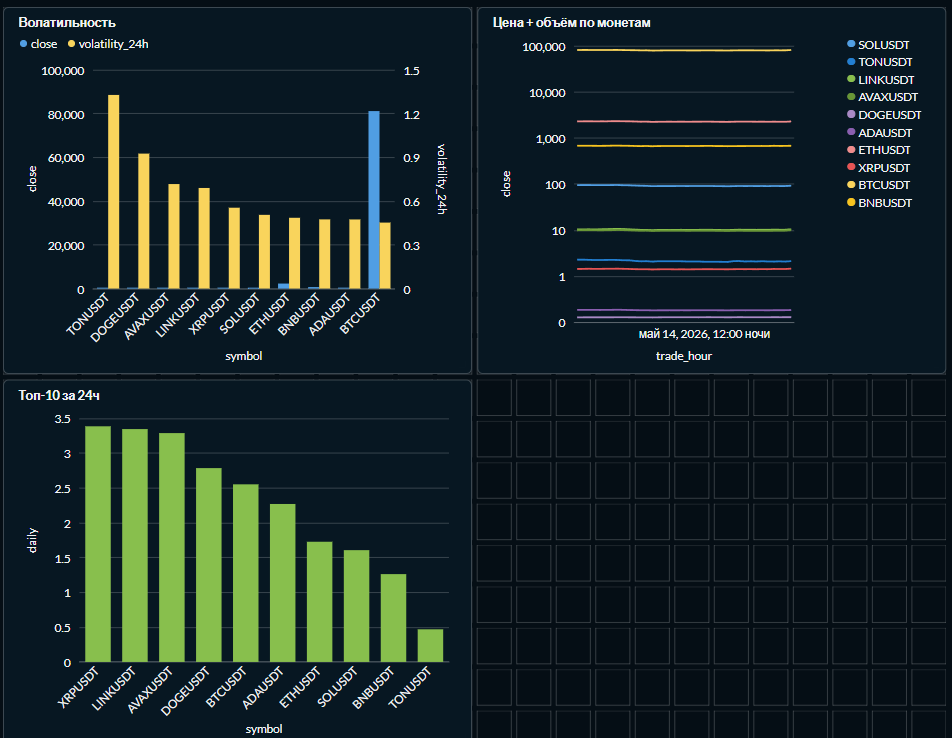

## Crypto OHLCV Pipeline

ETL-пайплайн для сбора и анализа цен монет с биржи Binance.
Каждый час забирает свежие свечи по 10 топовым USDT-парам, нормализует, 
строит аналитическую витрину со скользящими средними и волатильностью, 
визуализирует в Metabase.


## Архитектура

Binance REST API -> hourly klines -> raw_ohlcv  
raw_ohlcv фильтрация, проверки -> stg_ohlcv  
stg_ohlcv window functions: MA, волатильность -> mart_hourly  
mart_hourly -> Metabase Dashboard  

raw_ohlcv — сырые свечи с Binance, как пришли  
stg_ohlcv — очищенные данные с типами и FK на dim_symbol  
mart_hourly — витрина с MA12/MA24, hourly_return, volatility_24h  


## Запуск:

```bash
git clone https://github.com//new_p.git
cd new_p
cp .env.example .env
# заполни .env
docker compose up -d
```


## После запуска:

- Airflow UI — http://localhost:8080 (логин: airflow / пароль: airflow)
- Metabase — http://localhost:3000
- Postgres — localhost:5433


## Метрики в витрине

```
hourly_return     = (close - prev_close) / prev_close * 100
ma12              = AVG(close) OVER (12 hours)
ma24              = AVG(close) OVER (24 hours)
volatility_12h    = STDDEV(hourly_return) OVER (12 hours)
volatility_24h    = STDDEV(hourly_return) OVER (24 hours)
```


## Дашборд

